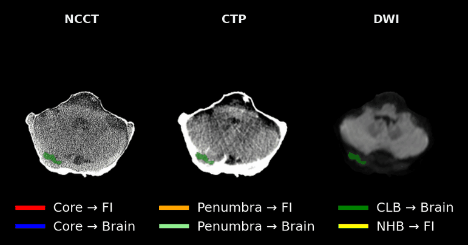

# Bi-temporal Image-driven Acute Stroke Evolution Analysis — code

<p align="center">
  
</p>

<p align="center"><sub>
One case, swept head-to-foot through the axial slices where all three modalities
overlap: admission NCCT and CTP at T<sub>1</sub>, follow-up DWI at
T<sub>2</sub>, overlaid with the six outcome-aware ROI classes. The CTP slab is
shorter than the NCCT and DWI field of view, so the sweep is limited to the
slices CTP actually covers.
</sub></p>

Implementation for

> **Bi-temporal Image-driven Acute Stroke Evolution Analysis**
> Md Sazidur Rahman, Kjersti Engan, Kathinka Dæhli Kurz, Mahdieh Khanmohammadi
> University of Stavanger · Stavanger University Hospital

[](https://yokko123.github.io/bi-temporal-ctp-dwi/)
[](https://doi.org/10.5281/zenodo.23209370)
[](LICENSE)

**Project page:** https://yokko123.github.io/bi-temporal-ctp-dwi/

**Accepted at IEEE BHI 2026.** Not yet on IEEE Xplore; the paper DOI goes into
`CITATION.cff` once it is. The code itself is archived on Zenodo:
[10.5281/zenodo.23209370](https://doi.org/10.5281/zenodo.23209370).

## What it does

Admission CT perfusion (CTP) at T₁ is registered to follow-up DWI at T₂, and the
two label sets are intersected into six outcome-aware ROI classes. Admission
tissue is then described with four feature families, and each class is tested
against the fate it went on to have.

```
01_preprocessing/   DICOM -> NIfTI, CTP motion correction, CTP/DWI -> NCCT
                    registration, skull stripping, and the six ROI classes
                    (analysis/make_roi_gif.py builds the animation above)
02_features/        FE1 baseline statistics, FE2 GLCM radiomics,
                    FE3 mJ-Net embeddings, FE4 nnU-Net embeddings
03_analysis/        region-pair tests, ablation, subgroups, figures
demo/               synthetic cohort, so stage 03 is runnable without data
tests/              unit tests for the statistics
```

## Install

```bash
conda env create -f environment.yml
conda activate bitemporal
```

Stage 03 needs only the scientific Python stack. Stages 01 and 02 additionally
need SimpleITK, PyRadiomics, PyTorch, nnU-Net v2, SynthStrip and SynthSeg; see
each stage's README.

## Quick start, without any data

```bash
python demo/make_synthetic_cohort.py --out-dir demo/data
cd 03_analysis
python run_table3_region_pairs.py --config ../demo/data/config.yaml
python run_table4_ablation.py     --config ../demo/data/config.yaml
python run_figures.py             --config ../demo/data/config.yaml
```

The synthetic cohort plants the effect the paper reports: salvaged and infarcted
penumbra separate, the two core classes do not, and infarcted non-hypoperfused
brain sits furthest from healthy contralateral brain. The numbers are
meaningless clinically; the point is that the pipeline runs and its output has
the expected shape.

```bash
python -m pytest tests -q
```

## With real data

```bash
cd 03_analysis
cp config.example.yaml config.yaml    # then fill in your paths
python run_table3_region_pairs.py --config config.yaml --cohort sus
python run_table3_region_pairs.py --config config.yaml --cohort isles
python run_table4_ablation.py     --config config.yaml
python run_table5_subgroups.py    --config config.yaml
python run_figures.py             --config config.yaml
```

Relative paths in `config.yaml` resolve against the config file's own directory,
so a config keeps working from any working directory.

## Data

Nothing in this repository is patient data.

* The **Stavanger University Hospital (SUH) cohort** is retrospective hospital
  data and cannot be shared.
* **ISLES'24** is public: https://isles-24.grand-challenge.org/

Stages 01 and 02 read every root from an environment variable, each defaulting
to an obvious `/path/to/...` placeholder, so nothing silently points at someone
else's filesystem.

| Variable | Points at |
|---|---|
| `SUS_DICOM_ROOT` | raw SUH DICOM |
| `SUS_CTP_GT_ROOT` | expert core / penumbra annotations (T1) |
| `SUS_DWI_GT_ROOT` | expert final-infarct annotations (T2) |
| `SUS_CTP_NATIVE_MASKS` | CTP brain masks in native space |
| `SUS_CTP_PARAM_MAPS` | CTP-derived parametric maps (CBF, CBV, Tmax) |
| `SUS_CURATED_ROOT` | curated SUH cohort, with `derivatives/` |
| `SUS_WORK_ROOT` | registration / intermediate outputs |
| `SUS_SCRATCH_ROOT` | scratch space for preprocessing |
| `SIX_CLASS_LABEL_DIR` | the 6-class label maps from stage 01 |
| `ISLES24_RELEASE_DIR` | ISLES'24 release `.../version_7/train/derivatives` |
| `ISLES24_WORK_ROOT` | working directory for ISLES'24 intermediates |
| `NNUNET_DATASET_ROOT` | nnU-Net frame: `nnUNet_raw`, `nnUNet_preprocessed`, `nnUNet_trained_models` |
| `MJNET_CHECKPOINT_DIR` | trained mJ-Net cross-validation checkpoints |
| `MJNET_LOG_DIR` | SLURM log directory (must contain no spaces) |
| `FEATURE_WORK_ROOT` | where stage 02 writes its feature tables |
| `PREPROC_REPO_ROOT` | checkout of the standalone preprocessing repository |
| `CONDA_PREFIX_ROOT` | conda installation, for the SLURM scripts |
| `USER_WORK_ROOT` | generic fallback work directory |

The `SUS_` prefix and the `sus` cohort key are the hospital's Norwegian
abbreviation (Stavanger Universitetssjukehus); they denote the SUH cohort.

Most scripts also accept the same values as command-line arguments, which take
precedence over the environment.

Stage 03 takes its paths from `config.yaml` instead, since its inputs are the
feature tables rather than images.

## Conventions

Region names are the same everywhere, and are the paper's six classes:

| Name | Paper | Meaning |
|---|---|---|
| `core_fi` | ROI^fi_c | core, remained infarcted |
| `core_brain` | ROI^b_c | core, salvaged |
| `pen_fi` | ROI^fi_p | penumbra, progressed to infarct |
| `pen_brain` | ROI^b_p | penumbra, salvaged |
| `clb_brain` | ROI^b_CLB | contralateral healthy brain |
| `nhb_fi` | ROI^fi_NHB | non-hypoperfused brain, later infarcted |

The four region-pair tests, in paper order:

1. `pen_brain` vs `pen_fi` - salvaged vs infarcted penumbra
2. `core_brain` vs `core_fi` - salvaged vs infarcted core
3. `nhb_fi` vs `pen_fi` - infarct outside vs inside the hypoperfused area
4. `nhb_fi` vs `clb_brain` - infarcted non-hypoperfused brain vs healthy brain

Every test is patient level: slice descriptors are max-pooled to
(patient x region) before anything is tested.

## Citing

Cite the **paper** for the method and results, and the **Zenodo DOI** if you
need to pin the exact code you ran. See [`CITATION.cff`](CITATION.cff), or:

```bibtex
@inproceedings{rahman2026bitemporal,
  title     = {Bi-temporal Image-driven Acute Stroke Evolution Analysis},
  author    = {Rahman, Md Sazidur and Engan, Kjersti and
               D{\ae}hli Kurz, Kathinka and Khanmohammadi, Mahdieh},
  booktitle = {2026 IEEE-EMBS International Conference on Biomedical and Health Informatics (BHI)},
  year      = {2026},
  note      = {In press}
}

@software{rahman2026bitemporal_code,
  title     = {Bi-temporal Image-driven Acute Stroke Evolution Analysis},
  author    = {Rahman, Md Sazidur and Engan, Kjersti and
               D{\ae}hli Kurz, Kathinka and Khanmohammadi, Mahdieh},
  year      = {2026},
  publisher = {Zenodo},
  doi       = {10.5281/zenodo.23209370},
  url       = {https://doi.org/10.5281/zenodo.23209370},
  version   = {v1.0}
}
```

`10.5281/zenodo.23209370` is the concept DOI and always resolves to the newest
release; `10.5281/zenodo.23209371` pins v1.0 specifically.

## License

[MIT](LICENSE). Third-party components (mJ-Net, nnU-Net, SynthStrip/SynthSeg)
remain under their own licenses; see the LICENSE file.
